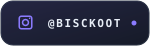

<!-- This file is generated. Edit build/panels.py and run `make`, not this. -->

<picture>
  <source media="(prefers-color-scheme: dark)" srcset="./assets/hero.dark.svg">
  <source media="(prefers-color-scheme: light)" srcset="./assets/hero.light.svg">
  
</picture>

<picture>
  <source media="(prefers-color-scheme: dark)" srcset="./assets/terminal.dark.svg">
  <source media="(prefers-color-scheme: light)" srcset="./assets/terminal.light.svg">
  
</picture>

<picture>
  <source media="(prefers-color-scheme: dark)" srcset="./assets/marquee.dark.svg">
  <source media="(prefers-color-scheme: light)" srcset="./assets/marquee.light.svg">
  
</picture>

<picture>
  <source media="(prefers-color-scheme: dark)" srcset="./assets/div-activity.dark.svg">
  <source media="(prefers-color-scheme: light)" srcset="./assets/div-activity.light.svg">
  
</picture>

<picture>
  <source media="(prefers-color-scheme: dark)" srcset="./assets/heatmap.dark.svg">
  <source media="(prefers-color-scheme: light)" srcset="./assets/heatmap.light.svg">
  
</picture>

<picture>
  <source media="(prefers-color-scheme: dark)" srcset="./assets/footer.dark.svg">
  <source media="(prefers-color-scheme: light)" srcset="./assets/footer.light.svg">
  
</picture>

  <a href="mailto:amish.tufail2002@gmail.com">
    <picture>
      <source media="(prefers-color-scheme: dark)" srcset="./assets/badge-email.dark.svg">
      <source media="(prefers-color-scheme: light)" srcset="./assets/badge-email.light.svg">
      
    </picture>
  </a>
  <a href="https://instagram.com/bisckoot">
    <picture>
      <source media="(prefers-color-scheme: dark)" srcset="./assets/badge-instagram.dark.svg">
      <source media="(prefers-color-scheme: light)" srcset="./assets/badge-instagram.light.svg">
      
    </picture>
  </a>
  <a href="https://github.com/amish-tufail?tab=repositories">
    <picture>
      <source media="(prefers-color-scheme: dark)" srcset="./assets/badge-repos.dark.svg">
      <source media="(prefers-color-scheme: light)" srcset="./assets/badge-repos.light.svg">
      
    </picture>
  </a>

