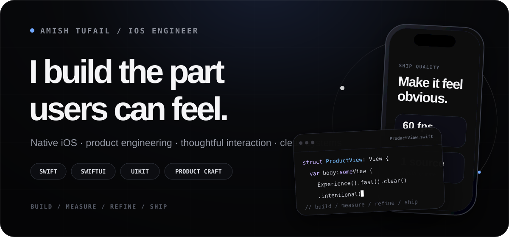
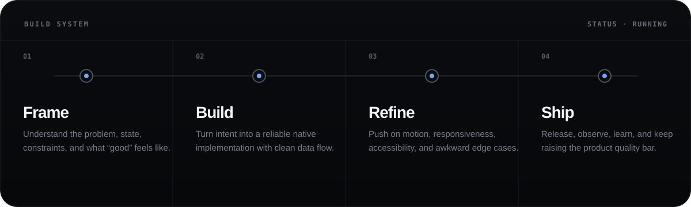
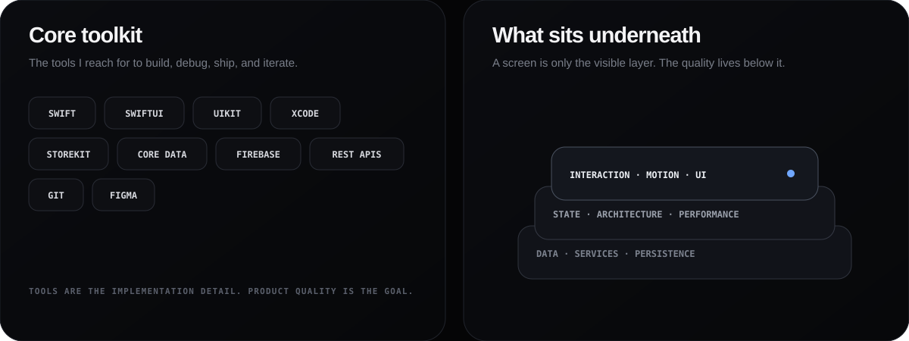
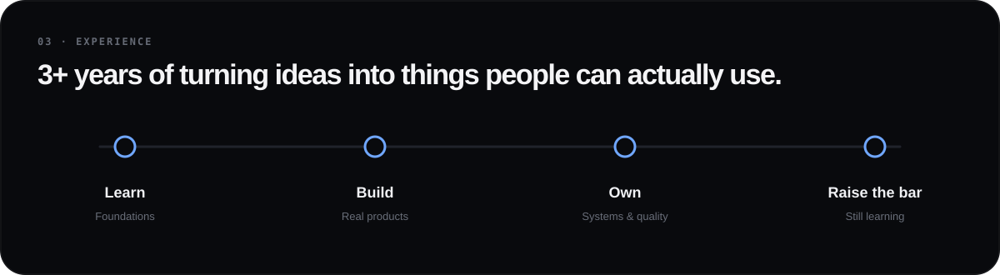
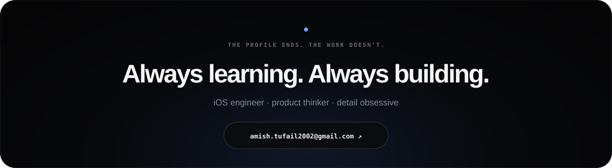

  

  <a href="https://amish-tufail.github.io/amish-tufail/"><strong>OPEN INTERACTIVE PROFILE ↗</strong></a>

 

### `01 · HOW I WORK`

## Engineering is a loop, not a handoff.

I think about the whole path from product intent to shipped behaviour — not just the code in the middle.

  

 

### `02 · NATIVE STACK`

## Tools are the implementation detail. Product quality is the goal.

  

 

  

 

  

